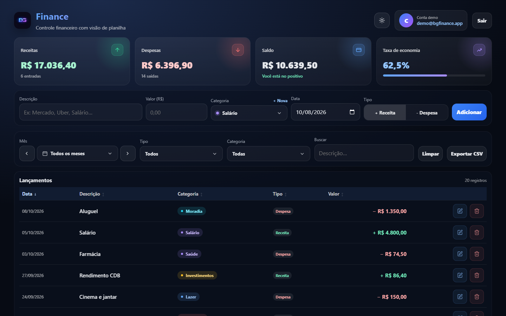
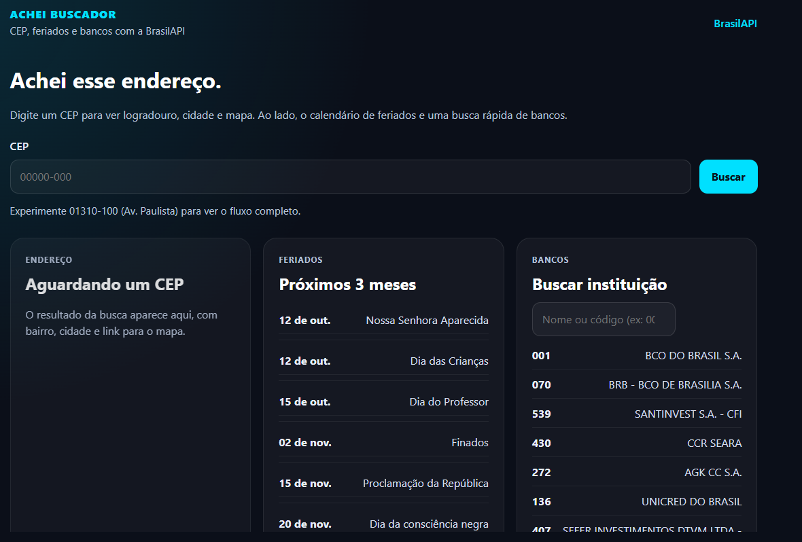
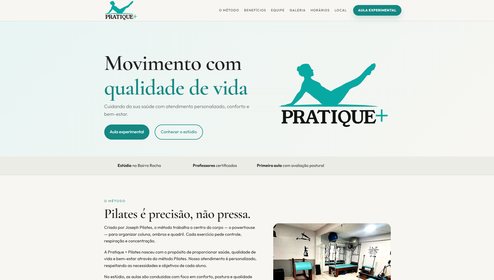
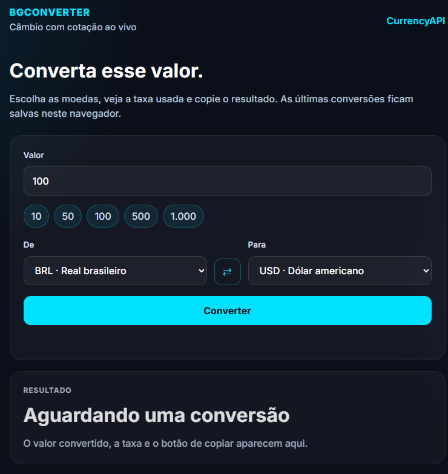
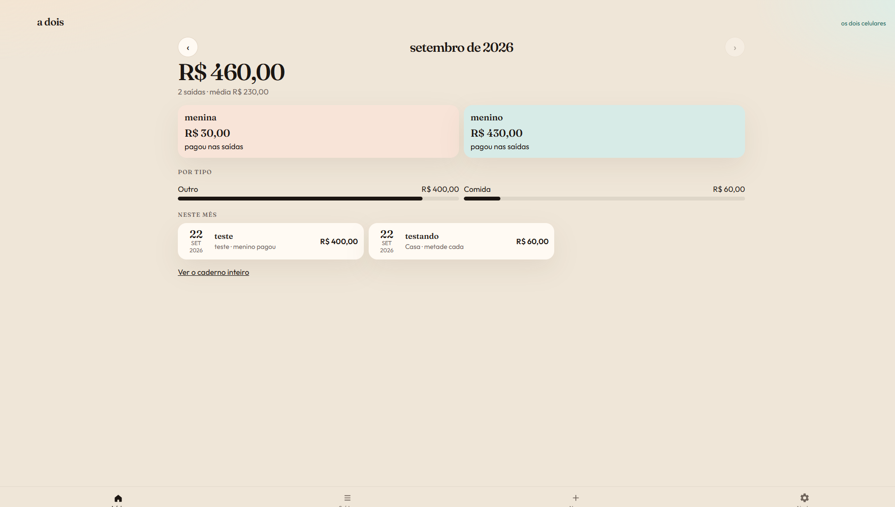
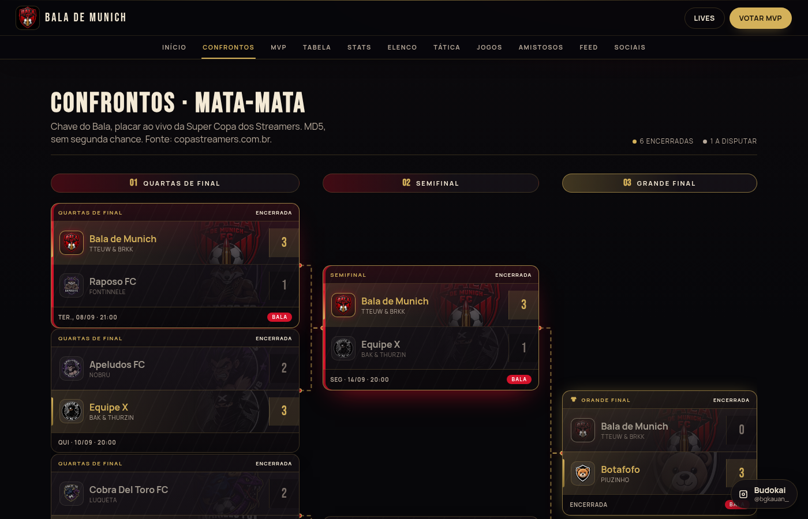

# Portfólio — Kauan Borges

Site pessoal com projetos, stack e currículo (PT/EN).

**Ao vivo:** [portifolio-bgkauan.vercel.app](https://portifolio-bgkauan.vercel.app/)

## Stack

HTML · CSS · JavaScript · deploy na Vercel

## Projetos em destaque

### BG Finance

Aplicação web de controle financeiro com autenticação, receitas e despesas, categorização, gráficos mensais, planilha e exportação CSV. PostgreSQL.

[Site](https://bg-finance.onrender.com) · [Código](https://github.com/kauanbg-dev/bg-finance)

### Achei Buscador

Consulta de CEP, feriados e bancos com React e BrasilAPI, com histórico no navegador.

[Site](https://achei-buscador.vercel.app/) · [Código](https://github.com/kauanbg-dev/achei-buscador)

### Pratique + Pilates

Site institucional responsivo do estúdio, com serviços e CTAs de contato.

[Site](https://pratique-pilates.vercel.app/) · [Código](https://github.com/kauanbg-dev/pratique-pilates)

### BgConverter

Conversão de moedas com cotação em tempo real, histórico e cópia do resultado.

[Site](https://bgconverter.vercel.app/) · [Código](https://github.com/kauanbg-dev/bgconverter)

### A Dois

PWA de gastos compartilhados: quem pagou e sync entre dispositivos via código de casal no Redis.

[Site](https://adois-chi.vercel.app/) · [Código](https://github.com/kauanbg-dev/adois)

### Bala de Munich

Plataforma do time na Super Copa dos Streamers: elenco, tabela, confrontos, stats, MVP e lives.

[Site](https://balademunich.vercel.app/) · [Código](https://github.com/kauanbg-dev/bala-de-munich)

## Contato

[kauanbg.dev@gmail.com](mailto:kauanbg.dev@gmail.com) · [LinkedIn](https://www.linkedin.com/in/kauan-borges-079074370/) · [GitHub](https://github.com/kauanbg-dev)
